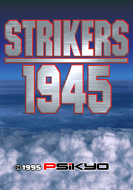
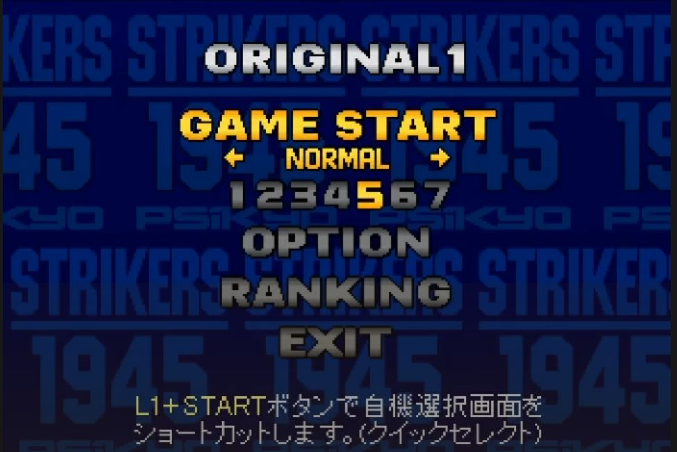
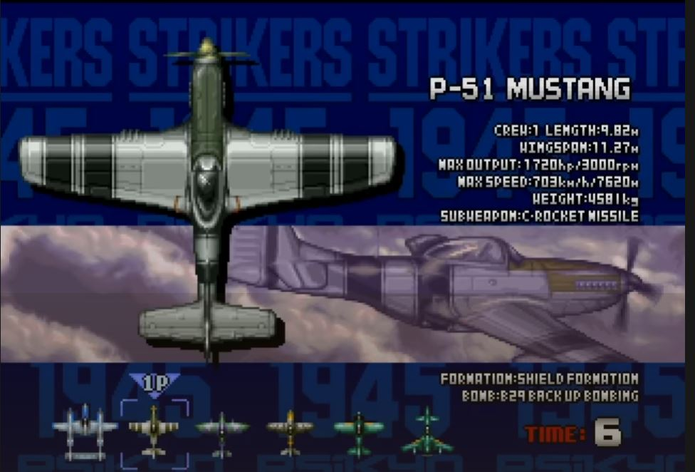
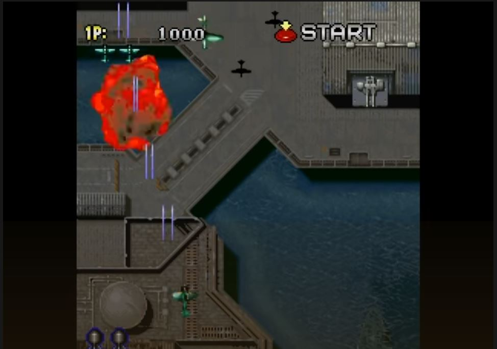
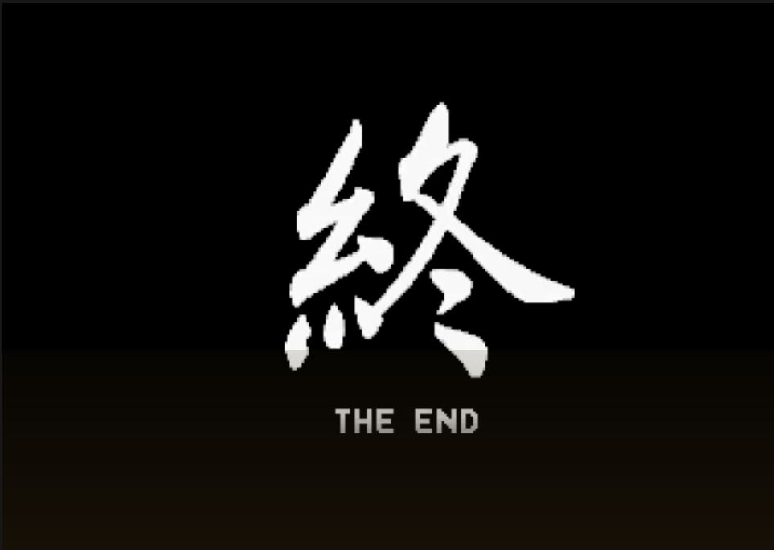
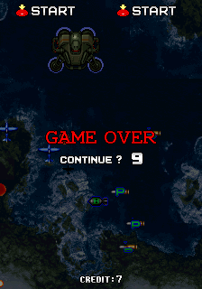
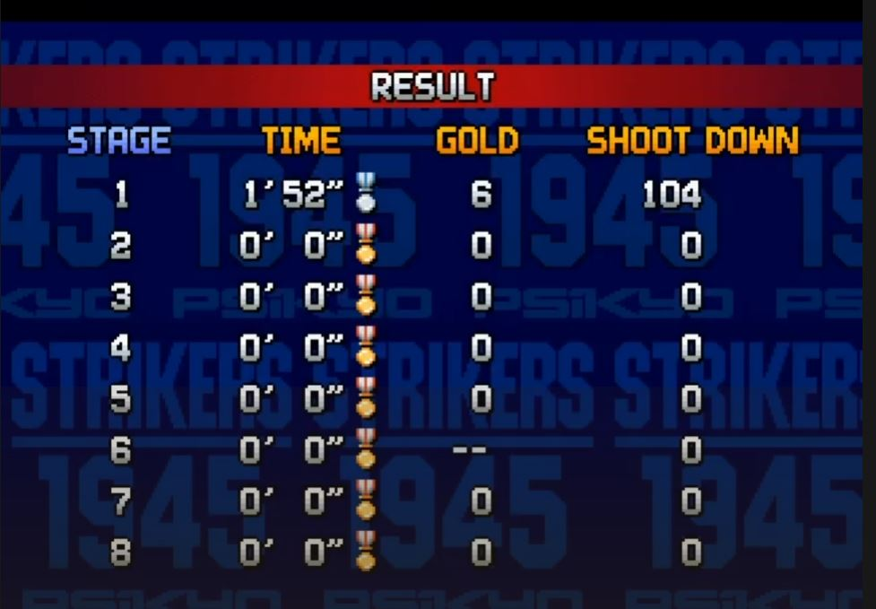
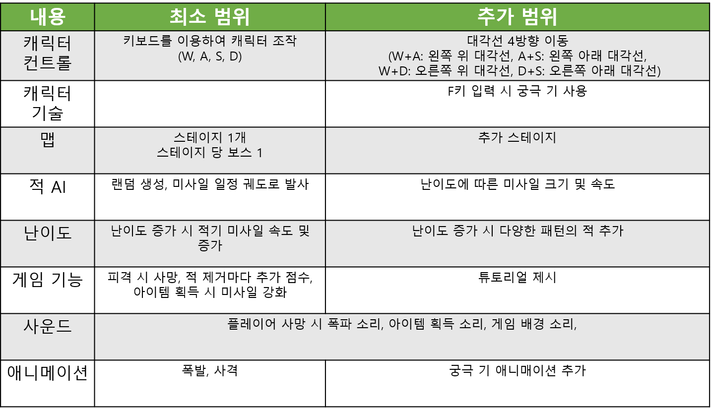
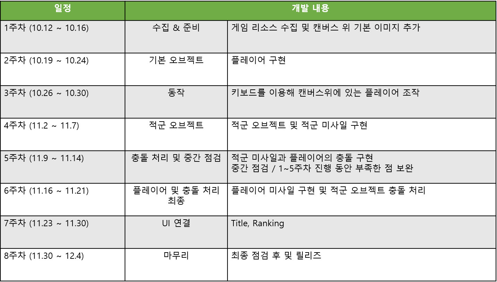

# 2020년 2학기 2D게임 프로그래밍 기말 프로젝트 1차 발표   
## Strikers 1945   
### Game Concept    
 - 플레이어를 조작하여 미사일을 피하고 적기를 파괴하는 슈팅게임   
 - 아이템을 획득하여 라이프 회복 혹은 미사일을 강화한다   
 - 플레이어 사망 시 강화된 미사일은 사라지고 기본 미사일을 발사 한다
 - 해당 스테이지 보스를 처치하면 게임(Stage) 클리어 한다    
 - Life : 플레이어의 목숨이 0이 되면 Game Over
 - Item : 플레잉어의 life 증가 혹은 미사일 업그레이드     
 
### Game Flow
- Loading Scene(로딩 후 클릭 시 메인화면 이동)   
     
- Title Scene(Game Start 선택 시 Game Scene 이동, Ranking 선택 시 Ranking Scene 이동)       
    
- Character Select Scene   
      
- Game Scene    
     
      
     
- Ranking Scene    
     
 
### 개발 범위
      

### 개발 일정
      
