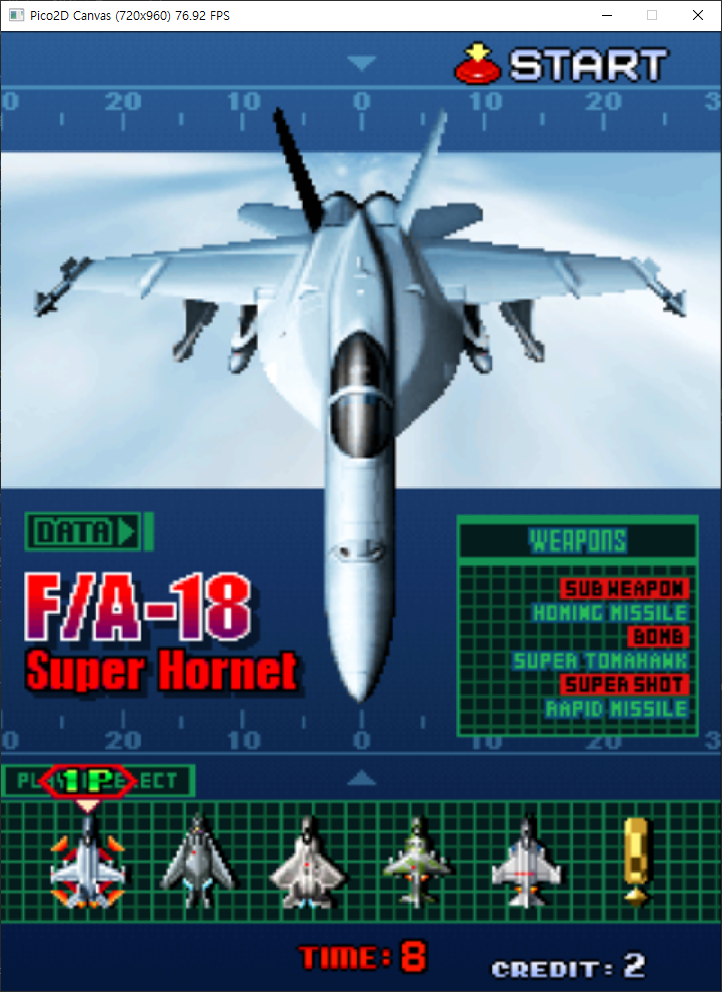
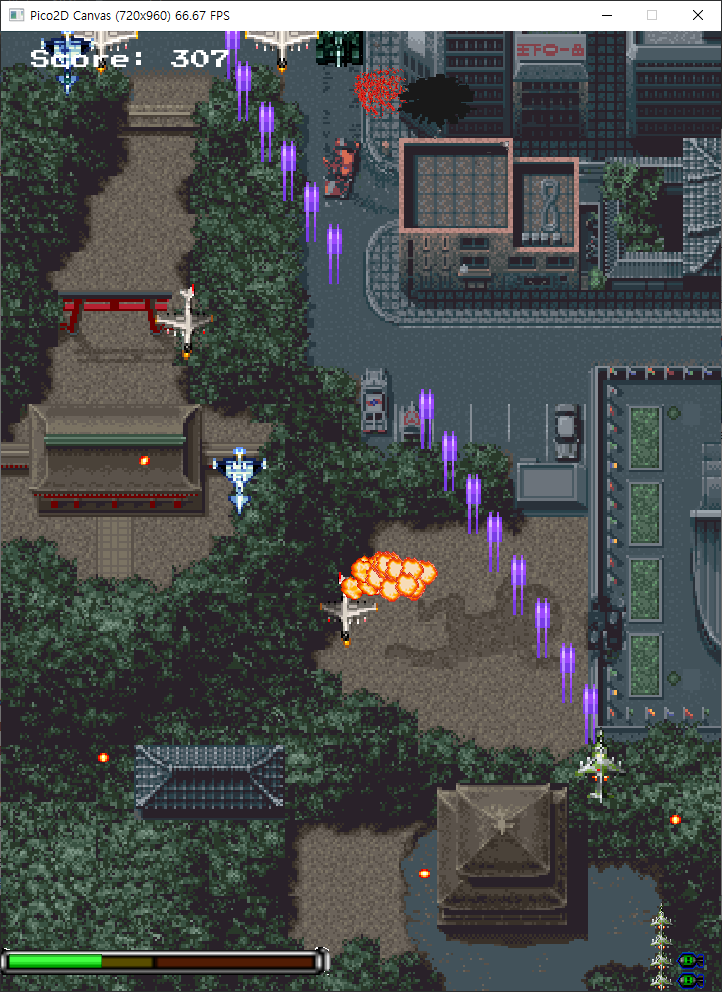
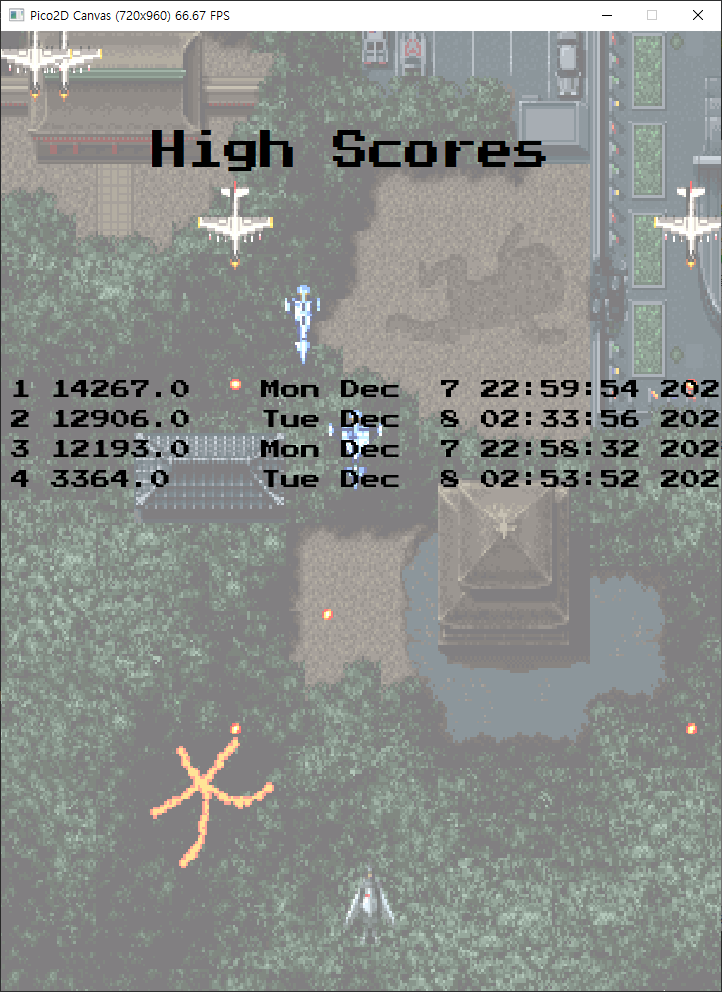
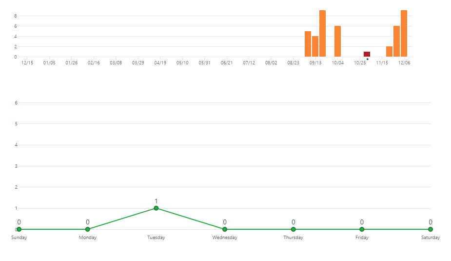
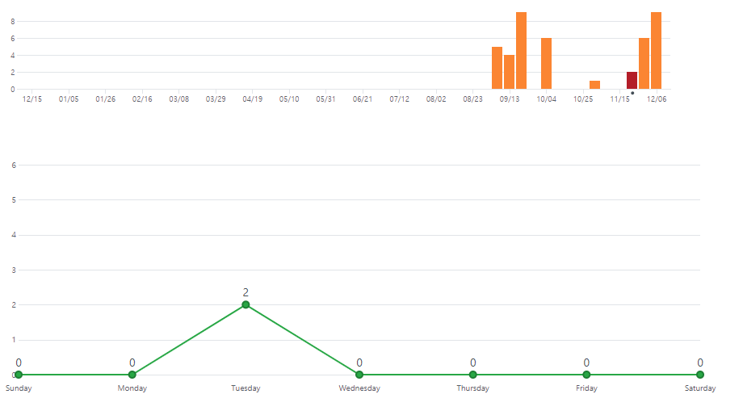
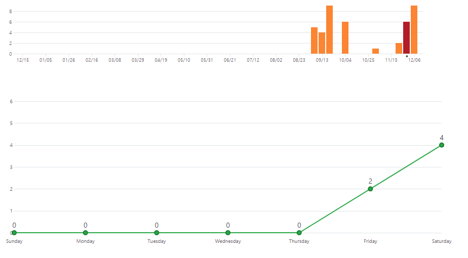
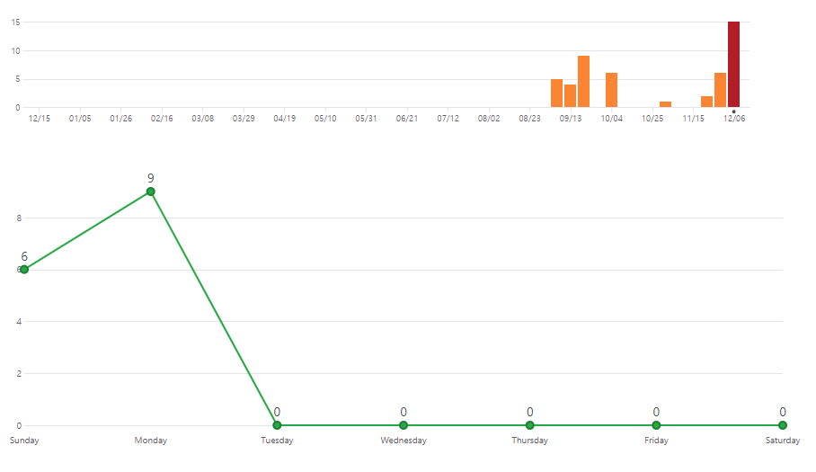

# 2020년 2학기 2D게임 프로그래밍 기말 프로젝트    
## 1. 게임의 소개   
### 제목 : Strikers 1945   
 - 1945 오락게임(copy)   
 - 1인 플레이어만 가능하게 할 예정   
    

## 2. GameState (Scene) 의 수 및 각각의 이름
- loading_state   
- title_state  
- main_state    
- game_over_state     
 
## 3. 각 GameState 별 다음 항목   
### 1. loading_state  
 - 게임 실행시 가장 먼저 실행된다    
 - 일정시간(약 1초) 지난 후 자동으로 title_state으로 change된다.    
    
### 2. title_state  
 - 키보드 방향키 및 스페이스키를 이용해 플레이어 선택      
 - 플레이어 선택 후 main_state로 push된다.   
    
### 3. main_state    
 - 게임을 플레이하는 Scene    
 - 게임 오버 혹은 클리어 한 경우 바로 game_over_state로 change된다.     
    
### 4. game_over_state   
 - 게임 오버 혹은 클리어 한 경우 저장된 high score를 보여준다.       
    

## 4. 필요한 기술
 - 기본적으로 플레이어를 움직일 수 있는 키보드 입력     
 - 충돌을 확인하는 기능   
 - 플레이점수 기록과 불러오는 기능    
 - 사운드 처리        
 
 ## 5. 개발 진척도
 내용 | 구현계획 범위 | 미 구현 범위 | 구현정도
 ---- | ----------- |------------ | --------
 캐릭터 컨트롤 | 키보드를 이용하여 캐릭터 조작 & 대각선 4방향 이동 |     | 100%
 캐릭터 기술 | 기본 공격(space key), 히페리온(s key), 레이저(a key) |      | 100%
 맵 | 스테이지 1개 (중간 보스 & 최종 보스) |    | 100%
 적 AI | 랜덤 생성, 미사일 일정 궤도로 발사 | 최종 보스 몬스터 구현 미완성 | 80%
 충돌처리 | 플레이어 미사일 -> 몬스터, 몬스터 미사일 -> 플레이어, 아이템(강화, 폭탄) -> 플레이어 |   | 100%
 게임기능 | 피격 시 사망, 적 제거마다 추가 점수, 아이템 획득 시 미사일 강화 | 강화 아이템 생성 시 이미지 불러오기 구현 안됨 (투명한 상태로 맵을 돌아다님) | 80%
 사운드 | 플레이어 사망 시 폭파 소리, 아이템 획득 소리, 게임 배경 소리 |   | 100%
 애니매이션 | 폭발, 사격, 궁극기(히페리온) 애니메이션 추가 |      | 100%
 
 ## 6. 주차별 깃허브 커밋 횟수
 
 3주차 커밋
 
 5주차 커밋
 
 6주차 커밋
 
 7주차 커밋
 
 ## 7. 발표 영상 링크
  - 1차 발표 : https://www.youtube.com/watch?v=75_z4VfRwX4
  - 2차 발표 : 
  - 3차 발표 : https://www.youtube.com/watch?v=g3w-wgJbvoA
