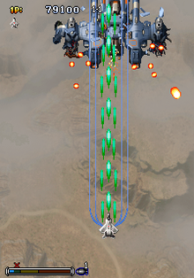

# 2020년 2학기 2D게임 프로그래밍 기말 프로젝트    
## 1. 게임의 소개   
### 제목 : Strikers 1945   
 - 1945 오락게임(copy)   
 - 1인 플레이어만 가능하게 할 예정   
    

## 2. GameState (Scene) 의 수 및 각각의 이름
- Loading Scene   
- Title Scene  
- Game Scene    
- Pause Scene  
- Ranking Scene   
 
## 3. 각 GameState 별 다음 항목   
### 1. Loading Scene  
 - 게임 실행시 가장 먼저 실행되는 Scene
 - 일정시간 지난 후 자동으로 TitleScene으로 change됨
### 2. Title Scene  
 - Game Start, Rank, Exit버튼 키보드 혹은 마우스로 선택가능
 - 버튼 별 Scene Push 경로    
     Game Start -> Game Scene   
     Rank -> HighScore Scene   
     Exit -> 게임 종료   
### 3. Game Scene    
 - 게임을 플레이하는 Scene    
 - 게임 오버 혹은 클리어 한 경우 Ranking Scene으로 change됨
### 4. Pause Scene   
 - 특정 키를 입력받아 실행되는 일시정지 Scene   
 - Pause를 하게될 경우 penalty 존재   
### 5. Ranking Scene   
 - 게임 오버 혹은 클리어 한 경우 누적점수를 저장 혹은 불러오는 Scene  

## 4. 필요한 기술
 - UI를 선택할 수 있는 마우스 입력    
 - 기본적으로 플레이어를 움직일 수 있는 키보드 입력     
 - 충돌을 확인하는 기능   
 - 플레이점수 기록과 불러오는 기능    
 - 가능할 시 1인 이상의 플레이어로 동작     
